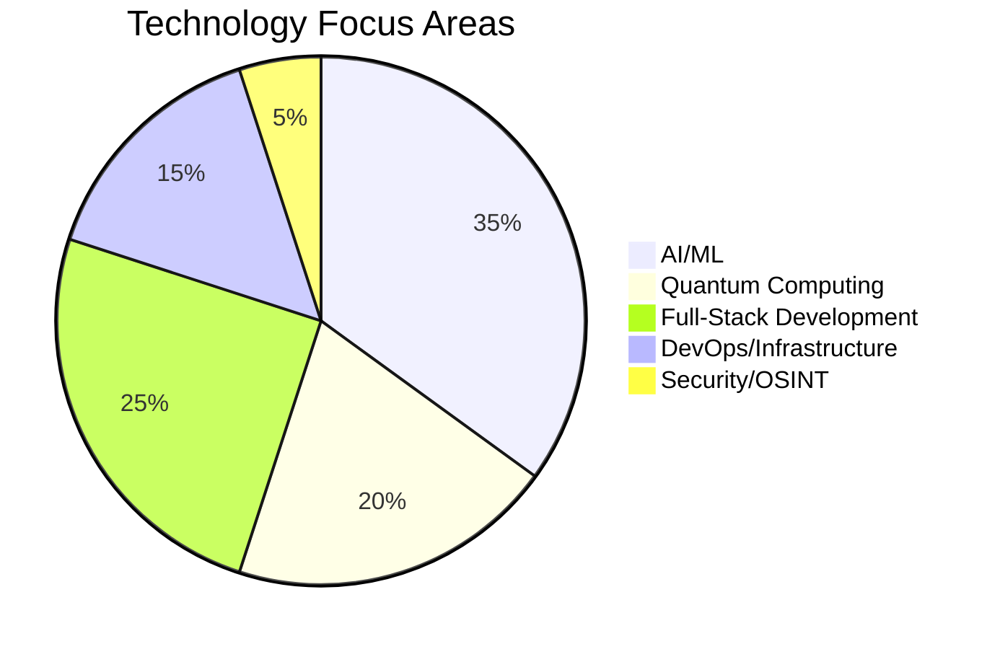
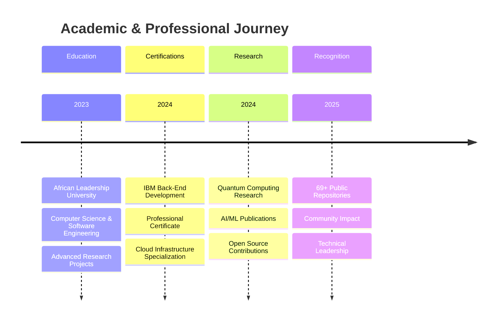

<div align="center">


</div>

# Hello, I'm `Miranics` 👨‍💻

<div align="center">

[](https://git.io/typing-svg)

</div>

```ascii
╔═══════════════════════════════════════════════════════════════════════╗
║  🌟 Welcome to my GitHub Laboratory                                  ║
║  🔬 Where Code Meets Innovation                                      ║  
║  🚀 69+ Repositories | AI/ML | Quantum | Full-Stack | DevOps        ║
╚═══════════════════════════════════════════════════════════════════════╝
```

<p align="center">
  <em>Passionate software engineer and researcher specializing in artificial intelligence, quantum computing, and distributed systems. Currently advancing computational frontiers at African Leadership University while contributing to next-generation technologies.</em>
</p>

---

<div align="center">

## � **EXPERTISE DOMAINS**

</div>

```mermaid
graph TD
    A[🧠 Miranics] --> B[🤖 AI/ML Engineering]
    A --> C[⚛️ Quantum Computing]
    A --> D[🌐 Full-Stack Development]
    A --> E[☁️ DevOps Engineering]
    A --> F[🛡️ Cybersecurity Research]
    A --> G[📊 Data Science]
    
    B --> B1[LLMs • Neural Networks • Deep Learning]
    C --> C1[CUDA Quantum • Circuit Simulation]
    D --> D1[React • Node.js • Python • APIs]
    E --> E1[Kubernetes • Docker • Cloud]
    F --> F1[OSINT • Security Tools • Research]
    G --> G1[Analytics • Visualization • ML]
    
    style A fill:#667eea,stroke:#764ba2,stroke-width:3px,color:#fff
    style B fill:#FF6B6B,stroke:#FF5252,stroke-width:2px,color:#fff
    style C fill:#4ECDC4,stroke:#26A69A,stroke-width:2px,color:#fff
    style D fill:#45B7D1,stroke:#2196F3,stroke-width:2px,color:#fff
    style E fill:#96CEB4,stroke:#4CAF50,stroke-width:2px,color:#fff
    style F fill:#FFEAA7,stroke:#FFC107,stroke-width:2px,color:#000
    style G fill:#DDA0DD,stroke:#9C27B0,stroke-width:2px,color:#fff
---

<div align="center">

## ⚡ **TECHNOLOGY ARSENAL**

</div>

<details>
<summary><b>� Artificial Intelligence & Machine Learning</b></summary>
<br>

<div align="center">


</div>
</details>

<details>
<summary><b>⚛️ Quantum Computing & High-Performance Computing</b></summary>
<br>

<div align="center">


</div>
</details>

<details>
<summary><b>🌐 Full-Stack Development</b></summary>
<br>

<div align="center">


</div>
</details>

<details>
<summary><b>☁️ DevOps & Cloud Infrastructure</b></summary>
<br>

<div align="center">


</div>
</details>

<details>
<summary><b>🗄️ Databases & Storage</b></summary>
<br>

<div align="center">


</div>
</details>

<details>
<summary><b>🛡️ Security & OSINT Tools</b></summary>
<br>

<div align="center">


</div>
</details>

---

<div align="center">

## 🌟 **SIGNATURE PROJECTS**

</div>

<div align="center">

### 🏆 **FEATURED: Hii_Nen - Advanced AI Full-Stack Application**

[](https://github.com/Miranics/Hii_Nen)

```mermaid
graph LR
    A[🎯 Hii_Nen Architecture] --> B[Frontend Layer]
    A --> C[AI Engine]
    A --> D[Backend Services]
    A --> E[Database Layer]
    
    B --> B1[React/Next.js]
    B --> B2[Responsive UI]
    B --> B3[Real-time Updates]
    
    C --> C1[Machine Learning]
    C --> C2[Natural Language Processing]
    C --> C3[Predictive Analytics]
    
    D --> D1[Node.js/Express]
    D --> D2[RESTful APIs]
    D --> D3[Authentication]
    
    E --> E1[Database Management]
    E --> E2[Data Analytics]
    E --> E3[Performance Optimization]
    
    style A fill:#667eea,stroke:#764ba2,stroke-width:3px,color:#fff
    style B fill:#FF6B6B,stroke:#FF5252,stroke-width:2px,color:#fff
    style C fill:#4ECDC4,stroke:#26A69A,stroke-width:2px,color:#fff
    style D fill:#45B7D1,stroke:#2196F3,stroke-width:2px,color:#fff
    style E fill:#96CEB4,stroke:#4CAF50,stroke-width:2px,color:#fff
```


<div align="center">

### 🚀 **OTHER NOTABLE PROJECTS**

</div>

<div align="center">
<table>
<tr>
<td width="50%">

### 🤖 **AI & Machine Learning**

[](https://github.com/Miranics/LLMs-from-scratch)

[](https://github.com/Miranics/Megatron-LM)

**Key Technologies:**
```yaml
🧠 Custom Transformer Architecture
🔄 Distributed Training Pipelines  
📊 Performance Optimization
🤖 Multi-agent AI Systems
```

</td>
<td width="50%">

### ⚛️ **Quantum Computing**

[](https://github.com/Miranics/cuda-quantum)

[](https://github.com/Miranics/cuQuantum)

**Key Technologies:**
```yaml
🌌 Quantum Circuit Simulation
⚡ GPU-Accelerated Computing
🔬 NVIDIA Quantum SDK
🎯 Hybrid Algorithms
```

</td>
</tr>
<tr>
<td width="50%">

### 🌐 **Full-Stack Development**

[](https://github.com/Miranics/MoMo-full-stack-application)

[](https://github.com/Miranics/grade-book-app_Nanen-Miranics)

**Key Technologies:**
```yaml
💰 Payment Processing Systems
📚 Educational Platforms
🎨 Modern UI/UX Design
📱 Responsive Applications
```

</td>
<td width="50%">

### 🛡️ **Security & DevOps**

[](https://github.com/Miranics/blackbird)

[](https://github.com/Miranics/azure-powershell)

**Key Technologies:**
```yaml
🔍 Advanced OSINT Tools
☁️ Cloud Infrastructure
🔧 Kubernetes Automation
🛡️ Security Research
```

</td>
</tr>
</table>
</div>

<div align="center">

### 📊 **PROJECT TECHNOLOGY DISTRIBUTION**



</div>

---

<div align="center">

## 📊 **PERFORMANCE METRICS**

</div>

<div align="center">


</div>

<div align="center">


</div>

<div align="center">

### 📈 **Development Activity Flow**

```mermaid
gitgraph
    commit id: "Initial Setup"
    branch ai-research
    checkout ai-research
    commit id: "LLM Implementation"
    commit id: "Neural Networks"
    checkout main
    merge ai-research
    branch quantum-computing
    checkout quantum-computing
    commit id: "CUDA Quantum"
    commit id: "Circuit Simulation"
    checkout main
    merge quantum-computing
    branch full-stack
    checkout full-stack
    commit id: "Hii_Nen App"
    commit id: "MoMo Platform"
    checkout main
    merge full-stack
    commit id: "Integration & Deployment"
```

</div>

<details>
<summary><b>📈 Contribution Graph</b></summary>
<br>


</details>

<div align="center">

### 🏆 **GitHub Achievements**
---

<div align="center">

## 🎯 **CURRENT RESEARCH & DEVELOPMENT**

</div>

<div align="center">

### 🔬 **Research Architecture**

```mermaid
graph TB
    A[🔬 Research Focus] --> B[Quantum-Classical Hybrids]
    A --> C[Large Language Models]
    A --> D[Distributed AI Systems]
    A --> E[Blockchain Security]
    
    B --> B1[NISQ Applications]
    B --> B2[Variational Algorithms]
    B --> B3[Error Correction]
    
    C --> C1[Transformer Architecture]
    C --> C2[Custom Training Pipelines]
    C --> C3[Model Optimization]
    
    D --> D1[Multi-GPU Training]
    D --> D2[Federated Learning]
    D --> D3[Edge Computing]
    
    E --> E1[Smart Contract Auditing]
    E --> E2[DeFi Security]
    E --> E3[Cryptographic Analysis]
    
    style A fill:#667eea,stroke:#764ba2,stroke-width:4px,color:#fff
    style B fill:#FF6B6B,stroke:#FF5252,stroke-width:2px,color:#fff
    style C fill:#4ECDC4,stroke:#26A69A,stroke-width:2px,color:#fff
    style D fill:#45B7D1,stroke:#2196F3,stroke-width:2px,color:#fff
    style E fill:#96CEB4,stroke:#4CAF50,stroke-width:2px,color:#fff
```



</div>

<details>
<summary><b>🚀 Advanced Kubernetes Patterns</b></summary>

- **Service Mesh Architecture** - Istio, Linkerd, Consul Connect
- **Custom Resource Definitions** - Building domain-specific operators
- **Multi-cluster Management** - Federation and cross-cluster networking
- **Security Policies** - RBAC, Network Policies, Pod Security Standards

</details>

<details>
<summary><b>⚡ High-Performance Computing</b></summary>

- **CUDA Programming** - Parallel algorithms and GPU optimization
- **Distributed Computing** - MPI, OpenMP, and cluster computing
- **Memory Management** - Efficient data structures for large-scale processing
- **Performance Profiling** - NVIDIA Nsight, Intel VTune, and custom metrics

</details>

<details>
<summary><b>☁️ Cloud-Native Development</b></summary>

- **Microservices Architecture** - Event-driven and reactive patterns
- **Observability Stack** - Prometheus, Grafana, Jaeger, OpenTelemetry
- **API Gateway Patterns** - Rate limiting, authentication, transformation
- **Infrastructure as Code** - Terraform, Pulumi, GitOps workflows

</details>

<details>
<summary><b>🤖 MLOps & AI Engineering</b></summary>

- **Model Deployment** - Real-time inference, batch processing, edge computing
- **Pipeline Orchestration** - Kubeflow, MLflow, Apache Airflow
- **Model Monitoring** - Drift detection, performance tracking, A/B testing
- **Data Engineering** - Feature stores, data versioning, ETL pipelines

</details>

---

<div align="center">

## 🏆 **ACHIEVEMENTS & RECOGNITION**

</div>

<div align="center">

### 🎖️ **Professional Certifications & Academic Excellence**



</div>

---

<div align="center">

## 🌐 **PROFESSIONAL NETWORK**

</div>

<div align="center">

[](mailto:002nasya@gmail.com)
[](https://github.com/Miranics)

</div>

<div align="center">

```ascii
╔══════════════════════════════════════════════════════════════════════════╗
║                   🤝 COLLABORATION OPPORTUNITIES                        ║
║                                                                          ║
║  🔬 Research Projects    🚀 Open Source     💼 Consulting               ║
║  🎓 Mentoring           🌟 Innovation       🤖 AI/ML Solutions          ║
╚══════════════════════════════════════════════════════════════════════════╝
```

</div>

---

<div align="center">

## 💭 **PHILOSOPHY**

*"At the intersection of quantum mechanics, artificial intelligence, and distributed systems lies the next paradigm of computational evolution. Every algorithm we craft today shapes the technological landscape of tomorrow."*

</div>

---

<div align="center">


### 🚀 **Building Tomorrow's Technology Today** 🚀

**✨ 69+ Repositories | 🤖 AI Research | ⚛️ Quantum Computing | 🌐 Full-Stack | ☁️ DevOps | 🛡️ Security ✨**

[](https://github.com/Miranics)
[](https://github.com/Miranics?tab=followers)
[](https://github.com/Miranics?tab=repositories)

</div>

# Hello, I'm `Miranics` 👨‍💻

<div align="center">

[](https://git.io/typing-svg)

</div>

```ascii
╔═══════════════════════════════════════════════════════════════════════╗
║  🌟 Welcome to my GitHub Laboratory                                  ║
║  🔬 Where Code Meets Innovation                                      ║  
║  🚀 69+ Repositories | AI/ML | Quantum | Full-Stack | DevOps        ║
╚═══════════════════════════════════════════════════════════════════════╝
```

<p align="center">
  <em>Passionate software engineer and researcher specializing in artificial intelligence, quantum computing, and distributed systems. Currently advancing computational frontiers at African Leadership University while contributing to next-generation technologies.</em>
</p>

---

<div align="center">

## 🎯 **EXPERTISE DOMAINS**

</div>

<table align="center">
<tr>
<td align="center" width="200px">

<br><strong>AI/ML Engineering</strong>
<br><sub>LLMs • Neural Networks • Deep Learning</sub>
</td>
<td align="center" width="200px">

<br><strong>Quantum Computing</strong>
<br><sub>CUDA Quantum • Circuit Simulation</sub>
</td>
<td align="center" width="200px">

<br><strong>Full-Stack Development</strong>
<br><sub>Web Apps • Microservices • APIs</sub>
</td>
</tr>
<tr>
<td align="center" width="200px">

<br><strong>DevOps Engineering</strong>
<br><sub>Kubernetes • Docker • Cloud</sub>
</td>
<td align="center" width="200px">

<br><strong>Cybersecurity</strong>
<br><sub>OSINT • Security Tools • Research</sub>
</td>
<td align="center" width="200px">

<br><strong>Research & Innovation</strong>
<br><sub>Open Source • Publications • Patents</sub>
</td>
</tr>
</table>

---

<div align="center">

## ⚡ **TECHNOLOGY ARSENAL**

</div>

<details>
<summary><b>🧠 Artificial Intelligence & Machine Learning</b></summary>
<br>

<div align="center">


</div>
</details>

<details>
<summary><b>⚛️ Quantum Computing & High-Performance Computing</b></summary>
<br>

<div align="center">


</div>
</details>

<details>
<summary><b>🌐 Full-Stack Development</b></summary>
<br>

<div align="center">


</div>
</details>

<details>
<summary><b>☁️ DevOps & Cloud Infrastructure</b></summary>
<br>

<div align="center">


</div>
</details>

<details>
<summary><b>🗄️ Databases & Storage</b></summary>
<br>

<div align="center">


</div>
</details>

<details>
<summary><b>🛡️ Security & OSINT Tools</b></summary>
<br>

<div align="center">


</div>
</details>


---

## � `Featured Projects`

<sub>Highlighting some of my most impactful work across different domains:</sub>


---

<div align="center">

## 📊 **PERFORMANCE METRICS**

</div>

<div align="center">


</div>

<div align="center">


</div>

<details>
<summary><b>📈 Contribution Graph</b></summary>
<br>


</details>

<div align="center">

### 🏆 **GitHub Trophies**


</div>

---

## 🎯 `Current Focus Areas`

<sub>What I'm actively working on and learning:</sub>

### � **Research & Development**
- **Quantum-Classical Hybrid Algorithms** - Exploring NISQ applications
- **Large Language Model Architecture** - Custom transformer implementations
- **Distributed AI Training** - Multi-GPU and multi-node setups
- **Blockchain Security** - Smart contract auditing and DeFi protocols

### 🛠️ **Technical Skills Enhancement**
- **Advanced Kubernetes Patterns** - Service mesh, operators, and CRDs
- **High-Performance Computing** - CUDA programming and parallel algorithms
- **Cloud-Native Development** - Microservices architecture and observability
- **MLOps Pipeline Design** - End-to-end model deployment and monitoring

### 📚 **Continuous Learning**
- **Quantum Machine Learning** - Variational quantum algorithms
- **Financial Technology** - Algorithmic trading and risk management
- **Cybersecurity Research** - Advanced persistent threat detection
- **Open Source Contribution** - Contributing to major projects like TensorFlow, Kubernetes

---

<div align="center">

## 🏆 **ACHIEVEMENTS & RECOGNITION**

</div>

<div align="center">
<table>
<tr>
<td align="center" width="20%">

<br><strong>🎓 ALU Graduate</strong>
<br><sub>Computer Science & Software Engineering</sub>
</td>
<td align="center" width="20%">

<br><strong>🏅 IBM Certified</strong>
<br><sub>Back-End Development Professional</sub>
</td>
<td align="center" width="20%">

<br><strong>🌟 69+ Repositories</strong>
<br><sub>Diverse Technical Portfolio</sub>
</td>
<td align="center" width="20%">

<br><strong>🤝 Open Source</strong>
<br><sub>Active Community Contributor</sub>
</td>
<td align="center" width="20%">

<br><strong>📊 Research Focus</strong>
<br><sub>Quantum-AI Hybrid Algorithms</sub>
</td>
</tr>
</table>
</div>

---

<div align="center">

## 🌐 **PROFESSIONAL NETWORK**

</div>

<div align="center">

[](mailto:002nasya@gmail.com)
[](https://github.com/Miranics)
[](#)

</div>

<div align="center">

```ascii
╔══════════════════════════════════════════════════════════════════════════╗
║                   🤝 COLLABORATION OPPORTUNITIES                        ║
║                                                                          ║
║  🔬 Research Projects    🚀 Open Source     💼 Consulting               ║
║  🎓 Mentoring           🌟 Innovation       🤖 AI/ML Solutions          ║
╚══════════════════════════════════════════════════════════════════════════╝
```

</div>

---

<div align="center">

## � **PHILOSOPHY**

*"At the intersection of quantum mechanics, artificial intelligence, and distributed systems lies the next paradigm of computational evolution. Every algorithm we craft today shapes the technological landscape of tomorrow."*

</div>

---

<div align="center">


### 🚀 **Building Tomorrow's Technology Today** 🚀

**✨ 69+ Repositories | 🤖 AI Research | ⚛️ Quantum Computing | 🌐 Full-Stack | ☁️ DevOps | 🛡️ Security ✨**

[](https://github.com/Miranics)
[](https://github.com/Miranics?tab=followers)
[](https://github.com/Miranics?tab=repositories)

</div>

