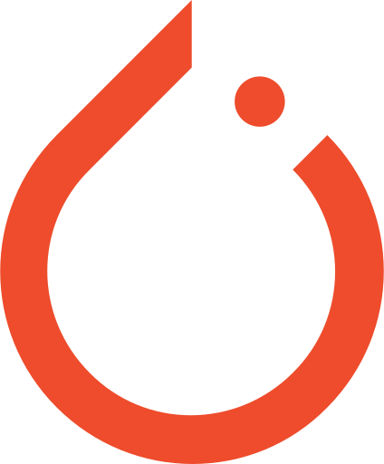

# Nanen Miracle Mbanaade (Miranics)

Software engineer and machine learning researcher focused on applied ML, full‑stack systems, and quantum‑aware computing.

## About

I build production-ready applications and reproducible ML systems. My work spans model development, data pipelines, web backends and frontends, and deployment automation. I prioritize clarity, reproducibility, and practical impact.

## Areas of expertise

- Machine Learning & Deep Learning (modeling, evaluation, deployment)
- Full‑stack development (React, Node.js, Python APIs)
- MLOps & Cloud (Docker, Kubernetes, CI/CD)
- High‑performance computing (CUDA, C++) and quantum‑adjacent research

## Skills

  

    
    
<strong>Python</strong>

  

  

    
    
<strong>JavaScript</strong>

  

  

    
    
<strong>React</strong>

  

  

    
    
<strong>TensorFlow</strong>

  

  

    
    
<strong>PyTorch</strong>

  

  

    
    
<strong>C++</strong>

  

  

    
    
<strong>Docker</strong>

  

  

    
    
<strong>NumPy</strong>

  

  

    
    
<strong>Pandas</strong>

  

  

    
    
<strong>Jupyter</strong>

  

  

    
    
<strong>Git</strong>

  

  

    
    
<strong>Linux</strong>

  

## Selected projects

- Hii_Nen — AI full‑stack application: https://github.com/Miranics/Hii_Nen
- CardioVision — Medical ML research & demo: https://github.com/Miranics/CardioVision
- ML‑Cardiovascular‑Disease‑Risk‑Prediction — Jupyter research notebooks: https://github.com/Miranics/ML-Cardiovascular-Disease-Risk-Prediction
- ML_Multimodal‑User‑Auth‑System — Multimodal authentication pipeline: https://github.com/Miranics/ML_Multimodal-User-Auth-System

## Contact

- Email: 002nasya@gmail.com
- GitHub: https://github.com/Miranics

---

This file is a standardized profile README template. The automation script will use this to create pull requests updating each repository's `README.md`.
